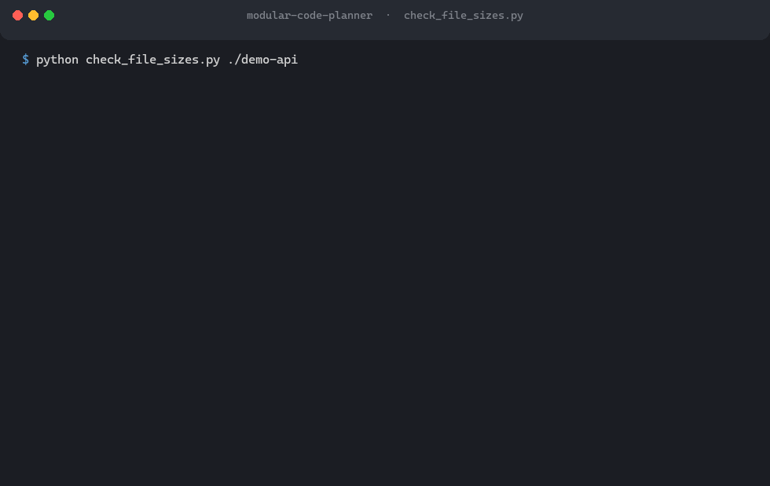

# modular-code-planner

**中文说明 → [README.zh-CN.md](README.zh-CN.md)**

[](https://github.com/Magicapple-Coder/modular-code-planner/actions/workflows/ci.yml)
[](https://github.com/Magicapple-Coder/modular-code-planner/releases)
[](LICENSE)
[](#requirements)
[](https://agentskills.io)

> **Stop your codebase from turning into one giant file.**
>
> An [Agent Skills](https://agentskills.io) package that plans modules before code is written, holds every file to a line budget, and splits existing monoliths without changing behaviour.



It does three things:

1. **Plan before coding** — for any task touching 3+ files or ~200+ lines, produce a module plan and get it approved *before* writing code.
2. **Enforce a file-size budget** — 300 / 500 line soft / hard thresholds, with a bundled scanner to check any project.
3. **Split crowded files safely** — a 5-phase refactoring workflow that moves code around without changing behavior.

Works with any agent that reads `SKILL.md`. No runtime dependency beyond Python 3.9+ for the scanner.

---

## The problem

Agents write code fast and rarely stop to split it. A utility file starts at 80 lines and ends at 1,400. Nobody notices until merge conflicts become unmanageable.

This skill makes file size a first-class constraint: plan modules up front, watch the line count as you go, and split existing monoliths without breaking them.

---

## Requirements

- Python **3.9+** for `scripts/check_file_sizes.py`. Standard library only — no `pip install`, no virtualenv, no network.
- Any agent that reads `SKILL.md`. The instructions themselves are plain Markdown and need nothing at all.

---

## Install

The package is a plain directory. Copy the whole folder into whichever skills directory your agent uses — no build step, no dependencies.

```bash
git clone https://github.com/Magicapple-Coder/modular-code-planner.git
```

Then copy it into place. Common locations:

| Agent | User-level (all projects) | Project-level |
|---|---|---|
| Claude Code | `~/.claude/skills/` | `<project>/.claude/skills/` |
| Codex CLI | `~/.agents/skills/` | `<project>/.agents/skills/` |
| Gemini CLI | `~/.gemini/skills/` or `~/.agents/skills/` | `<project>/.gemini/skills/` |
| GitHub Copilot | `~/.copilot/skills/` or `~/.agents/skills/` | `<project>/.github/skills/` or `.agents/skills/` |
| Cursor | `~/.cursor/skills/` | `<project>/.cursor/skills/` |
| OpenCode | `~/.config/opencode/skills/` | `<project>/.agents/skills/` |
| Windsurf | `~/.codeium/windsurf/skills/` | `<project>/.windsurf/skills/` |

Example (macOS / Linux):

```bash
mkdir -p ~/.claude/skills
cp -r modular-code-planner ~/.claude/skills/
```

Example (Windows, PowerShell):

```powershell
New-Item -ItemType Directory -Force "$HOME\.claude\skills" | Out-Null
Copy-Item -Recurse modular-code-planner "$HOME\.claude\skills\"
```

Newer agents that follow the open spec also read `~/.agents/skills/` as a shared location, so a single copy there can serve several tools at once. Check your agent's current documentation — skill discovery paths change between releases.

**Resulting layout** — the folder name must match the `name` field in `SKILL.md`:

```
<your-agent-skills-dir>/
└── modular-code-planner/
    ├── SKILL.md                 # loaded automatically by the agent
    ├── SKILL.en.md              # English edition (not auto-loaded)
    ├── references/
    │   ├── module-split-patterns.md   / .en.md
    │   └── refactoring-workflow.md    / .en.md
    ├── scripts/
    │   └── check_file_sizes.py
    └── tests/                   # only needed if you want to run the test suite
```

Copy the whole folder. Nothing outside `SKILL.md`, `references/` and `scripts/` is read at runtime.

---

## Usage

Once installed, just describe the task. The agent picks the right workflow automatically.

### Planning a new project

> Build a FastAPI service with JWT auth, Postgres, and a background job runner.

The agent reads the stack conventions from `references/module-split-patterns.md`, then proposes a directory tree, per-file responsibilities, estimated line counts, and dependency direction — and waits for your approval before writing anything.

### Checking an existing project

```bash
python3 /path/to/modular-code-planner/scripts/check_file_sizes.py ./src --lang en
```

```
Scanned 412 code files | soft >300 lines | hard >500 lines

== Files over threshold (split these) ==
  [HARD]   1842  services/order_service.py
  [HARD]    734  api/routes.py
  [warn]    412  models/user.py

== Entry files too long (target <=100 lines, wiring only) ==
  [entry]   287  main.py

== Longest 10 files ==
    1842  services/order_service.py
     734  api/routes.py
     ...

Summary: 1 over soft (>300), 2 over hard (>500), 1 long entry files (>100)
```

Output language follows the system locale by default; pass `--lang en` or `--lang zh` to force one.

Then ask:

> Split `services/order_service.py`.

The agent follows the 5-phase workflow: freeze behavior → read-only inventory → plan → incremental migration → verification and report. It will not touch a single file until you approve the plan.

### Script options

```
python3 scripts/check_file_sizes.py <path> [options]

  --soft N            warn above N lines            (default 300)
  --hard N            fail above N lines            (default 500)
  --entry-max N       entry-file target             (default 100)
  --top N             show top N longest files      (default 10)
  --ext a,b,c         scan these extensions only
  --ignore a,b        extra directory names to skip
  --exclude-glob a,b  extra filename globs to skip  (e.g. "*.generated.*")
  --json              machine-readable output
  --lang {auto,en,zh} output language               (default: auto)
```

Default extension set covers 35 common code extensions. Dependencies, build output, generated files, type declarations and lock files are skipped automatically.

Output uses the console's own encoding and degrades to `?` rather than crashing on a console that cannot render a character. Set `PYTHONIOENCODING=utf-8` for UTF-8 output — useful when piping into another tool or a log.

**Exit codes**

| Code | Meaning |
|---|---|
| `0` | No file exceeds the hard threshold |
| `1` | At least one file exceeds the hard threshold |
| `2` | Bad arguments, or the path does not exist / contains no scannable files |

Exit code `2` is deliberate: it prevents a typo in the path from being reported as a clean bill of health.

---

## Line-count thresholds

| Range | Status | Action |
|---|---|---|
| ≤ 300 | Healthy | Target state |
| 301–500 | Warning | Stop adding responsibilities; split now or schedule it |
| > 500 | Red line | Must be split before the task counts as done |
| Entry files (`main`, `index`, `app`, `__main__`) | > 100 | Entry files should only wire things together |

Generated code, lock files and type declarations are exempt — but the exemption must be stated in the report.

Tune the values per project: front-end components can relax to 400 / 600; strongly-typed backend logic can tighten to 200 / 400.

---

## What's inside

| Path | Purpose |
|---|---|
| `SKILL.md` | Three workflows, in Chinese — this is the file agents load automatically: plan new modules (A), split files that are growing (B), restructure existing monoliths (C) |
| `SKILL.en.md` | The same SKILL.md in English (not auto-loaded; use it if your host is configured for English, or just to read it) |
| `references/refactoring-workflow.md` · `.en.md` | The 5-phase safe-refactoring procedure, with exit conditions and a failure-handling table |
| `references/module-split-patterns.md` · `.en.md` | Layering model, 6 extraction techniques, conventions for Python / JS-TS / Java / Go / C#, 6 anti-patterns, interface-compatibility strategies, and signals that you should *not* split |
| `scripts/check_file_sizes.py` | Line-count scanner, standard library only |
| `tests/` | Self-tests for the scanner and for the package metadata. `python -m unittest discover -s tests -v` |
| `prompts/giant-file-split-prompt.zh-CN.md` · `.en.md` | Standalone prompt covering the same ground — for any chat model that does not support skills |
| `docs/demo.gif` | The terminal recording above |

Included in the refactoring workflow, because agent refactors usually fail there:

- **Phase 0 freezes behavior first** — no safety net, no split.
- **Hidden-coupling inventory** covers dynamic references that a symbol search cannot find: `getattr`, `importlib`, DI containers, component scanning, route strings, config class paths, decorator registries, `embed` directives.
- **Explicit anti-cheat rules** — an agent may not delete or skip tests, comment out failing code, or widen type checking to make verification pass.
- **Exit conditions on every phase**, so "done" means something.

---

## Notes and limitations

- **`SKILL.md` is written in Chinese**, since that is the file agents load by default. An English edition is provided as `SKILL.en.md`, and both `references/` documents have `.en.md` counterparts, but English content is not auto-loaded — rename or point your host at it if you need that.
- **Verification is not equivalence.** Splitting can preserve behavior and still break something your tests do not cover. The workflow requires the agent to state which parts are untested.
- **This skill constrains an agent, it does not control one.** A host may ignore `SKILL.md`, and `allowed-tools` support varies widely across agents — that is why this package does not declare it.

---

## Contributing

Rules, conventions, scanner flags — all welcome. See [CONTRIBUTING.md](CONTRIBUTING.md) for what fits and what does not, and for the agent-behaviour bug report template. Issues in English or Chinese.

If this saved you a refactor, a star helps the next person find it.

---

## License

MIT. See [LICENSE](LICENSE).
